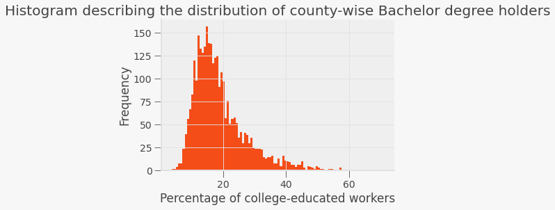
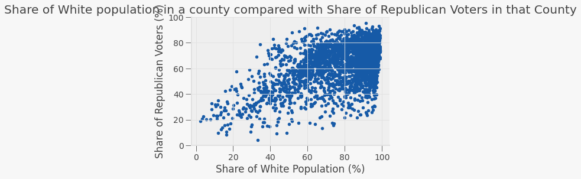
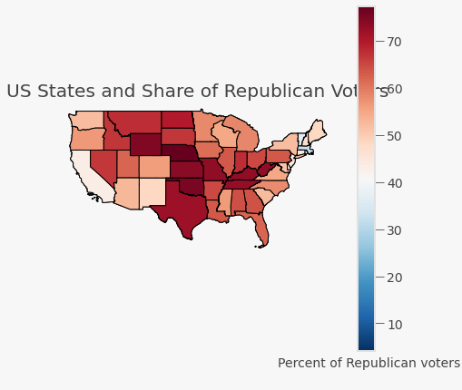

# Who Elected Trump in the 2016 Elections - the Role of Income, Race and Education 

By Janhavi Agarwal


```python
# importing libraries

import geopandas as gpd
import matplotlib.pyplot as plt
import pandas as pd
import numpy as np
import statsmodels.api as sm
from statsmodels.iolib.summary2 import summary_col

from shapely.geometry import Point

%matplotlib inline
import qeds
qeds.themes.mpl_style();
import warnings
warnings.filterwarnings('ignore')

from bokeh.io import output_notebook
from bokeh.plotting import figure, ColumnDataSource
from bokeh.io import output_notebook, show, output_file
from bokeh.plotting import figure
from bokeh.models import GeoJSONDataSource, LinearColorMapper, ColorBar, HoverTool
from bokeh.palettes import brewer
output_notebook()
import json
```


<div class="bk-root">
    <a href="https://bokeh.org" target="_blank" class="bk-logo bk-logo-small bk-logo-notebook"></a>
    <span id="1001">Loading BokehJS ...</span>
</div>


# Introduction 

The US presidential are always tumultuous and influenced by a variety of factors. In 2016, the world saw Donald Trump's unexpected win. In this paper, I will analyze the relation between several factors such as education levels (the percentage of population that has attained a Bachelor's degree), share of population that is White and median household income, and their share of Republican voters at a county level. I think that this is an important research topic since the world's affairs are dictated by who is in the White House and it is important to get to root of the people that determine that. I think this adds to the existing research since it will be a stepping stone to understanding and analyzing the 2020 US elections which recently took place. 

Throughout the paper, I use scatterplots and maps to observe these relationships. For the income data, I use web-scraping from a WikiPedia page containing data on median household income. In the end, I will use regressions to reach specific numbers which we can use to describe the relationship. 

##### Research Question: Is there a correlation between education, race, income, and the share of Republican voters at a county or state level, and if so, what is the relation? 

I do think that there will be a positive relation between share of White population and share of Republican voters since Republican ideologies on issues relating to gun possession, abortion laws, taxation policies and much more align with the majority of the population, and most of the US counties are inhabited by white people (as we will see in a histogram). In addition, I think that there will be a negative relation between the percentage of county population that has attained a Bachelor's degree and the share of Republican voters. This is because, people that have attained a university degree tend to be more liberal in their thought, and liberalism is a Democratic symbol. When it comes to income, I believe that there will be a negative relationship between median household income in each state and that state's share of Rpeublican voters.  

The X variables we will be working with are "Share of White population", "Share of College-educated population" and "Median Household Income". The Y variable is the level of Republican voters. 

These are some of the previous research papers I have looked at while writing this paper: 

- Gelman, A., Kenworthy, L., &amp; Su, Y. (2010). Income Inequality and Partisan Voting in the United States*. Social       Science Quarterly, 91(5), 1203-1219. doi:10.1111/j.1540-6237.2010.00728.x
- Gonino, L. (fall 2017). Blacks' and Whites' Attitudes toward Race-Based Policies: Is there an Obama Effect? Michigan       Sociological Review, 31, 173-188.
- Sides, J., Tesler, M., &amp; Vavreck, L. (September 2016). The Electoral Landscape of 2016. The Annals of the             American Academy of Political and Social Science, 667, elections in america, 50-71.

# Project 1

### Data Cleaning Process

The first step to analyzing the data is cleaning the data so that we have a workable DataFrame ready for analysis. On cleaning, the DataFrame we will be using for this part of the project is `county_char`.


```python
county_characteristics = pd.read_csv("/Users/janhavi/Desktop/eco225/project1/usa-2016-presidential-election-by-county.csv",
                                     sep=';')
county_char = county_characteristics[["State", "County", "Votes", "Republicans 2016", "Democrats 2016", 
                                       "White (Not Latino) Population", "African American Population",
                                       "Native American Population", "Asian American Population", 
                                       "Latino Population", "At Least Bachelors's Degree"]]
county_char["Other races"] = 100 - county_char["White (Not Latino) Population"]
county_char = county_char[["State", "County", "Votes", "Republicans 2016", "Democrats 2016", 
                            "White (Not Latino) Population", "Other races", "At Least Bachelors's Degree"]]
county_char.rename(columns = {"White (Not Latino) Population": "White", 
                               "At Least Bachelors's Degree":"Bachelor's Degree",
                              "Republicans 2016":"Republicans share",
                              "Democrats 2016": "Democrats share"}, inplace=True)
county_char = county_char.dropna()
county_char.head()
```


<div>
<style scoped>
    .dataframe tbody tr th:only-of-type {
        vertical-align: middle;
    }

    .dataframe tbody tr th {
        vertical-align: top;
    }

    .dataframe thead th {
        text-align: right;
    }
</style>
<table border="1" class="dataframe">
  <thead>
    <tr style="text-align: right;">
      <th></th>
      <th>State</th>
      <th>County</th>
      <th>Votes</th>
      <th>Republicans share</th>
      <th>Democrats share</th>
      <th>White</th>
      <th>Other races</th>
      <th>Bachelor's Degree</th>
    </tr>
  </thead>
  <tbody>
    <tr>
      <th>1</th>
      <td>Nebraska</td>
      <td>Red Willow County, Nebraska</td>
      <td>5061.0</td>
      <td>83.224659</td>
      <td>12.606204</td>
      <td>94.15</td>
      <td>5.85</td>
      <td>21.6</td>
    </tr>
    <tr>
      <th>2</th>
      <td>California</td>
      <td>Del Norte County, California</td>
      <td>9361.0</td>
      <td>54.844568</td>
      <td>37.228929</td>
      <td>66.05</td>
      <td>33.95</td>
      <td>14.3</td>
    </tr>
    <tr>
      <th>3</th>
      <td>Florida</td>
      <td>Duval County, Florida</td>
      <td>428734.0</td>
      <td>48.995648</td>
      <td>47.494950</td>
      <td>58.00</td>
      <td>42.00</td>
      <td>24.9</td>
    </tr>
    <tr>
      <th>4</th>
      <td>Kansas</td>
      <td>Ellsworth County, Kansas</td>
      <td>2626.0</td>
      <td>73.610053</td>
      <td>19.611577</td>
      <td>88.90</td>
      <td>11.10</td>
      <td>19.8</td>
    </tr>
    <tr>
      <th>5</th>
      <td>Kentucky</td>
      <td>Cumberland County, Kentucky</td>
      <td>3066.0</td>
      <td>81.604697</td>
      <td>14.970646</td>
      <td>94.70</td>
      <td>5.30</td>
      <td>7.9</td>
    </tr>
  </tbody>
</table>
</div>


```python

```

### Plotting a Histogram for the share of White population


```python
fig,ax = plt.subplots()

county_char.plot(kind="hist", y="White", color=(244/255, 77/255, 24/255),
                 bins=100, legend=False, density=False, ax=ax)

ax.set_xlabel("Percentage of Republican voters")
ax.set_title("Histogram describing the distribution of county-wise Republican voting percentages")
ax.spines['right'].set_visible(False)
ax.spines['top'].set_visible(False)
```


We see a heavily left-skewed histogram which means that most counties do tend to have a very high percentage of White population. 

### Plotting a Histogram for the share of population that holds a Bachelor's degree


```python
fig,ax = plt.subplots()

county_char.plot(kind="hist", y="Bachelor's Degree", color=(244/255, 77/255, 24/255),
                 bins=100, legend=False, density=False, ax=ax)

ax.set_xlabel("Percentage of college-educated workers")
ax.set_title("Histogram describing the distribution of county-wise Bachelor degree holders")
ax.spines['right'].set_visible(False)
ax.spines['top'].set_visible(False)
```





Here, we see a right skewed graph. Most counties do not have a very percentage of college educated population. 

In this project we just observed the overall trends of the X variables across counties in the US. In the next project, I will visualize the relation between the X variables and Y - the share of Republican voters. 

# Project 2

In this project I want to see what kind of relationship there exists between the X variables (Share of White population, share of college-educated population) and the Y-variable (Share of Republican voters) through visualizations.

#### The Message
There should be a relationship between the share of White population, college educated population and the share of Republican voters in the respective counties. 

### Visualizing the Data through Scatterplots

#### A scatterplot showing the relation between White population and Share of Repulican Voters


```python
fig,ax = plt.subplots()
county_char.plot(kind="scatter", x="White", y="Republicans share", ax=ax)

ax.set_ylim(0,100)
ax.spines['top'].set_visible(False)
ax.spines['right'].set_visible(False)
ax.set_xlabel("Share of White Population (%)")
ax.set_ylabel("Share of Republican Voters (%)")
ax.set_title("Share of White population in a county compared with Share of Republican Voters in that County")

plt.show()
```





In this scatterplot, we see that our hypothesis about share of White population and share of Republican voters having a positive relation is true. I will now compare the share of College educated share of population and share of Republican voters. 

#### A scatterplot showing the relation between College-educated population and Share of Repulican Voters


```python
fig,ax = plt.subplots(figsize=(4,4))
county_char.plot(kind="scatter", x="Bachelor's Degree", y="Republicans share", ax=ax, color='red')


ax.set_ylim(0,100)
ax.spines['top'].set_visible(False)
ax.spines['right'].set_visible(False)
ax.set_xlabel("Share of College-Educated Population (%)")
ax.set_ylabel("Share of Republican Voters (%)")
ax.set_title("Share of College-Educated population in a county compared with Share of Republican Voters in that County")

plt.show()
```


Again, as assumed in the hypothesis, there is a negative correlation between share of college-educated population and share of Republican voters. 

## Using maps to visualize the data 

We look at the correlation between our variables at a state level to make the visualizations easier. 

The first step is to make a GeoDataFrame that consists of the geometries of each state. I read a shapefile and then merge the DataFrame with the respective columns from `county_char`. I take the mean of the percentage of people with Bachelor's degrees and the percentage of White population across the counties in each state. The GeoDataFrame is then cleaned and saved under the name `maps_states_republicans`. 


```python
us_states = gpd.read_file('/Users/janhavi/Downloads/tl_2017_us_state/tl_2017_us_state.shp')
us_states_mainland = us_states.drop([31, 34, 35, 36, 41, 49, 40])
us_states_mainland.head()

states_republicans = county_char.groupby("State")["Republicans share"].mean().reset_index()
states_republicans = states_republicans.sort_values("Republicans share", ascending=True).reset_index().drop(columns="index")

states_republicans_educ = county_char.groupby("State")["Bachelor's Degree"].mean().reset_index()

states_republicans_white = county_char.groupby("State")["White"].mean().reset_index()

maps_states_republicans = us_states_mainland.merge(states_republicans, left_on='NAME', right_on='State', how='inner')
maps_states_republicans = maps_states_republicans.rename(columns = {"Republicans share":"republicans_2016"})
maps_states_republicans = maps_states_republicans.drop(["State", "REGION", "STATEFP", "GEOID", "STUSPS", "LSAD", "MTFCC",
                             "FUNCSTAT", "ALAND", "AWATER", "INTPTLAT","INTPTLON", "DIVISION", "STATENS"]
                                                       , axis=1)
maps_states_republicans = maps_states_republicans.merge(states_republicans_educ, left_on="NAME",
                                                        right_on="State", how='inner')

maps_states_republicans = maps_states_republicans.merge(states_republicans_white, left_on="NAME", 
                                                       right_on="State", how="inner")

maps_states_republicans = maps_states_republicans.drop(["State_x", "State_y"], axis=1)

maps_states_republicans = maps_states_republicans.rename(columns = {"Bachelor's Degree":"bachelors", 
                                                                   "White":"white", "NAME":"State"})

maps_states_republicans.head()
```


<div>
<style scoped>
    .dataframe tbody tr th:only-of-type {
        vertical-align: middle;
    }

    .dataframe tbody tr th {
        vertical-align: top;
    }

    .dataframe thead th {
        text-align: right;
    }
</style>
<table border="1" class="dataframe">
  <thead>
    <tr style="text-align: right;">
      <th></th>
      <th>State</th>
      <th>geometry</th>
      <th>republicans_2016</th>
      <th>bachelors</th>
      <th>white</th>
    </tr>
  </thead>
  <tbody>
    <tr>
      <th>0</th>
      <td>West Virginia</td>
      <td>POLYGON ((-81.74725 39.09538, -81.74635 39.096...</td>
      <td>73.095301</td>
      <td>13.794545</td>
      <td>95.169091</td>
    </tr>
    <tr>
      <th>1</th>
      <td>Florida</td>
      <td>MULTIPOLYGON (((-82.98748 24.62538, -82.98748 ...</td>
      <td>62.025003</td>
      <td>19.407463</td>
      <td>70.825373</td>
    </tr>
    <tr>
      <th>2</th>
      <td>Illinois</td>
      <td>POLYGON ((-91.18529 40.63780, -91.17510 40.643...</td>
      <td>63.425538</td>
      <td>18.777451</td>
      <td>88.791667</td>
    </tr>
    <tr>
      <th>3</th>
      <td>Minnesota</td>
      <td>POLYGON ((-96.78438 46.63050, -96.78434 46.630...</td>
      <td>58.359900</td>
      <td>20.748276</td>
      <td>91.134483</td>
    </tr>
    <tr>
      <th>4</th>
      <td>Maryland</td>
      <td>POLYGON ((-77.45881 39.22027, -77.45866 39.220...</td>
      <td>51.185476</td>
      <td>28.454167</td>
      <td>71.277083</td>
    </tr>
  </tbody>
</table>
</div>


### Visualizing Share of Republican Voters


```python
fig, gax = plt.subplots(figsize=(7,7))

maps_states_republicans.plot(ax=gax, edgecolor='black', color='white')

maps_states_republicans.plot(
    ax=gax, edgecolor='black', column='republicans_2016', legend=True, cmap='RdBu_r',
)
gax.annotate('Percent of Republican voters',xy=(0.60, 0.06),  xycoords='figure fraction')

gax.set_xlabel('longitude')
gax.set_ylabel('latitude')
gax.set_title("US States and Share of Republican Voters")
plt.axis('off')

plt.show()
```





From the map, we see that states with a higher Republican share of voters are concentrated in the middle of the country, while states with lower Republican population are found along the coasts. We will now see if this holds with our hypothesis from above.  

### Visualizing Share of White population 


```python
fig, gax = plt.subplots(figsize=(7,7))

maps_states_republicans.plot(ax=gax, edgecolor='black', color='white')

maps_states_republicans.plot(
    ax=gax, edgecolor='black', column='white', legend=True, cmap='RdBu_r',
)
gax.annotate('Percent of White voters',xy=(0.65, 0.06),  xycoords='figure fraction')

gax.set_xlabel('longitude')
gax.set_ylabel('latitude')
gax.set_title("US States and Share of White Voters")
plt.axis('off')

plt.show()
```


We see a higher concentration of White population in the north of the country while a lower concentration of White population in the south. A potential reason for this is that the US borders Mexico in the south and thus could have a higher immigrant population. Our pre-determined hypothesis holds for most states. 

### Visualizing Share of College-Educated population across the states 


```python
fig, gax = plt.subplots(figsize=(7,7))

maps_states_republicans.plot(ax=gax, edgecolor='black', color='white')

maps_states_republicans.plot(
    ax=gax, edgecolor='black', column='bachelors', legend=True, cmap='RdBu_r',
)
gax.annotate('Percent of college-educated voters',xy=(0.65, 0.06),  xycoords='figure fraction')

gax.set_xlabel('longitude')
gax.set_ylabel('latitude')
gax.set_title("US States and Share of College-Educated Voters")
plt.axis('off')

plt.show()
```


If we compare this map with the map showing the share of Republican voters, we see that the maps look like exact reverses of each other. This affirms our hypothesis. 

### Conclusion

The research question of this project was to see whether there was a relationship between education, race and share of Republican voters. Our hypothesis assumed that there is a negative relationship between share of population that has attained a Bachelor's degree and share of Republican voters, and positive relationship between share of White population and share of Republican voters. We used scatterplots to share this relation at a county level, and maps to show this relation at the state level. 

Our hypothesis was proven right but we do see a stronger relationship between education levels and share of Republican voters. 

# Project 3
In this project, I introduce a third X variable - median household income in each state. This is an important addition since it plays a big role in the socioeconomic characteristics of a country which eventually determine the election results. I this particular addition also matters since Democrats and Republicans have different ideas when it comes to taxation based on income. The level of income, and how it is spread across the country will determine the election results. 


##### Method:
I have scraped data from this website: https://en.wikipedia.org/wiki/List_of_U.S._states_and_territories_by_income

I have scraped the DataFrame and selected the columns 'State' and Median Household income in the year 2016 since I am analyzing the 2016 elections. I saved the scraped data under a DataFrame states_income. I then cleaned the data and merged it with my original DataFrame maps_states_republicans. I saved the merged DataFrame under states_map_income. I then analyze the DataFrame using an interactive map and a scatterplot. 

The program can be run annually since it will upload household median income annually. However, for this particular project, only the data pertaining to year 2016 is relevant. 

We can legally scrape the data since it is available on an open source platform (Wikipedia), and is publically available. 

###### Web Scraping and Data Cleaning Process

In this code, I scrape the data and store it in a new DataFrame called `states_income`. I then merge this with the original DataFrame `maps_states_republicans`. The new DataFrame is called `income_map_states` and view the first 5 rows. 


```python
import requests
import pandas as pd
from bs4 import BeautifulSoup

url = 'https://en.wikipedia.org/wiki/List_of_U.S._states_and_territories_by_income'
response = requests.get(url)

soup = BeautifulSoup(response.content)
data_table = soup.find('table','wikitable sortable')
all_values = data_table.find_all('tr')

income = pd.DataFrame(columns = ["State", "Income"])
ix=0

for row in all_values[1:]:
    values = row.find_all('td')
    State = values[1].text.strip('\n')
    Income = values[4].text.strip('\n')
    
    income.loc[ix] = [State, Income]
    ix += 1
    
states_income = income.drop([0, 8, 20, 47, 53, 54, 55, 56]).reset_index()
states_income = states_income.drop("index", axis=1)
states_income["State"] = states_income["State"].astype('string')
states_income["State"] = states_income["State"].str.strip()

income_map_states = pd.merge(maps_states_republicans, states_income, left_on='State', right_on="State", how='inner')

income_map_states["Income"] = income_map_states["Income"].str.replace("$","")    
income_map_states["Income"] = income_map_states["Income"].str.replace(",","")
income_map_states["Income"] = pd.to_numeric(income_map_states["Income"])
income_map_states.head()
```


<div>
<style scoped>
    .dataframe tbody tr th:only-of-type {
        vertical-align: middle;
    }

    .dataframe tbody tr th {
        vertical-align: top;
    }

    .dataframe thead th {
        text-align: right;
    }
</style>
<table border="1" class="dataframe">
  <thead>
    <tr style="text-align: right;">
      <th></th>
      <th>State</th>
      <th>geometry</th>
      <th>republicans_2016</th>
      <th>bachelors</th>
      <th>white</th>
      <th>Income</th>
    </tr>
  </thead>
  <tbody>
    <tr>
      <th>0</th>
      <td>West Virginia</td>
      <td>POLYGON ((-81.74725 39.09538, -81.74635 39.096...</td>
      <td>73.095301</td>
      <td>13.794545</td>
      <td>95.169091</td>
      <td>43385</td>
    </tr>
    <tr>
      <th>1</th>
      <td>Florida</td>
      <td>MULTIPOLYGON (((-82.98748 24.62538, -82.98748 ...</td>
      <td>62.025003</td>
      <td>19.407463</td>
      <td>70.825373</td>
      <td>50860</td>
    </tr>
    <tr>
      <th>2</th>
      <td>Illinois</td>
      <td>POLYGON ((-91.18529 40.63780, -91.17510 40.643...</td>
      <td>63.425538</td>
      <td>18.777451</td>
      <td>88.791667</td>
      <td>60960</td>
    </tr>
    <tr>
      <th>3</th>
      <td>Minnesota</td>
      <td>POLYGON ((-96.78438 46.63050, -96.78434 46.630...</td>
      <td>58.359900</td>
      <td>20.748276</td>
      <td>91.134483</td>
      <td>65599</td>
    </tr>
    <tr>
      <th>4</th>
      <td>Maryland</td>
      <td>POLYGON ((-77.45881 39.22027, -77.45866 39.220...</td>
      <td>51.185476</td>
      <td>28.454167</td>
      <td>71.277083</td>
      <td>78945</td>
    </tr>
  </tbody>
</table>
</div>


### Visualizing Income Data

#### Plotting a map 
As I did for education and race, I will plot a map which shows the median household income among the states. 


```python
fig, gax = plt.subplots(figsize=(7,7))

income_map_states.plot(ax=gax, edgecolor='black', color='white')

income_map_states.plot(
    ax=gax, edgecolor='black', column='Income', legend=True, cmap='RdBu',
)

gax.set_xlabel('longitude')
gax.set_ylabel('latitude')
gax.set_title("US States and their Median Household Income ($)")
plt.axis('on')
gax.annotate('Median Household Income',xy=(0.6, 0.06),  xycoords='figure fraction')

plt.show()
```


The states with higher income correspond to blue colored states in the map while the states with lower income correspond to states which are red in the map. On comparing this map with the map showing the share of Republican voters across the states, we see that states with a higher income correspond to states with a lower share of Republican voters and vice versa. Therefore we hypothesize that there will be a negative relation between median income and share of Republican voters. 
 
Why do states along the coast have higher median household incomes? 

This is due to the types of occupations that prevail in these states. Rich states like Massachusetts have mostly private sector based industries which contributes to the higher household income. On the other hand, states like Mississipi rely on agriculture and federal jobs for employment leading to lower household incomes. 

Source: https://www.investopedia.com/median-income-by-state-5070640

#### Plotting a Scatterplot

In order to plot a scatterplot, I will need to convert the GeoDataFrame `income_map_states` into a Pandas DataFrame. I then plot the scatterplot and interpret the results. 


```python
income_map_states_pd = pd.DataFrame(income_map_states)

fig,ax = plt.subplots(figsize=(5,5))
income_map_states_pd.plot(kind="scatter", x="Income", y="republicans_2016", ax=ax)

ax.set_ylim(0,100)
ax.spines['top'].set_visible(False)
ax.spines['right'].set_visible(False)
ax.set_xlabel("Median Household Income ($)")
ax.set_ylabel("Share of Republican Voters")
ax.set_title("Share of White population in a county compared Median Household Income across the States")

plt.show()
```


We see a negative correlation that is not very strong. Thus states with a higher median household income tend to have a lower share of Republican voters. 

### Project 3 Conclusion

The objective of this project was to find out whether there exists a relationship between Median household income of a state and its share of Republican voters. On plotting a map and scatterplot, we see that there exists a negative relationship between the two. 

The negative correlation is suprising since the Democrats have always perceived themselves as a more socialist party while the Republicans portray themselves as more capitalistic. According to a study 'Rich State, Poor State, Red State, Blue State: What’s the Matter with Connecticut?' in the Quarterly Journal of Political Science, 2007, 2: 345–36, income plays a large role in the voting preferences of Red states but little-to-no role in Blue states. In Red states, rich people vote Republican due to their lenient taxation policies. 

Another potential reason for the negative relation is that democrats tend to emphasize taxation policies that include taxing income more heavily. This may not impact a rich family as much as it will impact a low-income family. Thus there is a negative relationship. 

# Final Project

In my project, I have used 3 X variables - median household income, share of White population and share of college-educated population. The objective of using these X variables was to find whether there is a relationship between these variables and the Y variable which is "Share of Republican voters". At a state level, I believe that the relationship between these X variables and the Y variable is linear. 

For income data, I reach this conclusion by looking at the scatterplot which shows a negative linear relationship between the two variables. The linear relationship between income and voting patterns could be attributed to the difference in taxation policies followed by the Democrats and Republicans. Democats believe in more income tax which is something that richer households can afford. Lower income households may be unwilling to support this policy. This assumption holds in line with the hypothesis and established relation that there is a negative correlation between median household income and share of Republican voters in the states. 

For the race data, there is a clear positive linear relationship between share of white population and share of Republican voters. This could be because of the conservative socioeconomic policies followed by the Republicans that usually please White people more than POCs. This could be in the form of policing policies, abortion policies, gun policies and the blind eye turned to white supremacism. 

For the data on education, there is a negative linear relationship between share of college-educated population and share of Republican voters. This could be because higher education leads to liberalism in thought. Democrats are liberal in their policies and thus higher-educated people are more likely to vote Democrat. This establishes the negative relationship. 

In this project, I will run 4 regressions to get numeric values for the level of dependency. 

## Choosing X's
As mentioned above, the three X's I have chosen are income, race and education level. I will first plot scatterplots along with their regression lines before running the regressions. 

### The first X: Share of White population

We will plot a regression line on a scatterplot that shows share of White population and share of Republican voters.

We can write our model as:

$republicans2016_{i}$ = $β_{0}$ + $β_{1}$$white_{i}$ + $u_{i}$

Where:
- $ \beta_0 $ is the intercept of the regression line on the axis representing share of Republican voters
- $ \beta_1 $ is the slope of the regression line which shows the relation between share of White population and Republican voters
- $ u_i $ is a random error term 


```python
from sklearn.linear_model import LinearRegression

X = income_map_states_pd["white"].values.reshape(-1,1)
Y = income_map_states_pd["republicans_2016"].values.reshape(-1,1)
labels = income_map_states_pd["State"]

fig,ax = plt.subplots(figsize=(6,6))
income_map_states_pd.plot(kind="scatter", x="white", y="republicans_2016", ax=ax)

lr=LinearRegression()
lr.fit(X,Y)

x = np.linspace(0.0, 100.0).reshape(-1,1)
y_pred = lr.predict(x)
ax.plot(x, y_pred, color='blue')

ax.set_title("Regression line showing the relationship between share of White population and Republican Voters")

plt.show()


```


### The second X: Share of college-educated population

We will plot a regression line on a scatterplot that shows share of White population and share of Republican voters.

We can write our model as:

$republicans2016_{i}$ = $β_{0}$ + $β_{1}$$bachelors_{i}$ + $u_{i}$

Where:
- $ \beta_0 $ is the intercept of the regression line on the axis representing share of Republican voters
- $ \beta_1 $ is the slope of the regression line which shows the relation between share of college-educated population and Republican voters
- $ u_i $ is a random error term 


```python
from sklearn.linear_model import LinearRegression

X = income_map_states_pd["bachelors"].values.reshape(-1,1)
Y = income_map_states_pd["republicans_2016"].values.reshape(-1,1)
labels = income_map_states_pd["State"]

fig,ax = plt.subplots(figsize=(6,6))
income_map_states_pd.plot(kind="scatter", x="bachelors", y="republicans_2016", ax=ax)

lr=LinearRegression()
lr.fit(X,Y)

x = np.linspace(0.0, 100.0).reshape(-1,1)
y_pred = lr.predict(x)
ax.plot(x, y_pred, color='blue')

ax.set_ylim(0,100)
ax.set_title("Regression line showing the relationship between share of college-educated population and Republican Voters")

plt.show()
```


### The third X: Median Household Income 
We will plot a regression line on a scatterplot that shows share of White population and share of Republican voters.

We can write our model as:

$republicans2016_{i}$ = $β_{0}$ + $β_{1}$$Income_{i}$ + $u_{i}$

Where:
- $ \beta_0 $ is the intercept of the regression line on the axis representing share of Republican voters
- $ \beta_1 $ is the slope of the regression line which shows the relation between Median Household income and share of Republican voters
- $ u_i $ is a random error term 


```python
from sklearn.linear_model import LinearRegression

X = income_map_states_pd["Income"].values.reshape(-1,1)
Y = income_map_states_pd["republicans_2016"].values.reshape(-1,1)

fig,ax = plt.subplots(figsize=(6,6))
income_map_states_pd.plot(kind="scatter", x="Income", y="republicans_2016", ax=ax)

lr=LinearRegression()
lr.fit(X,Y)

x = np.linspace(0.0, 100.0).reshape(-1,1)
y_pred = lr.predict(x)
ax.plot(x, y_pred, color='blue')

ax.set_title("Regression line showing the relationship between Median household income and Republican Voters")
ax.set_xlabel("Median Household Income ($)")
plt.show()
```


## Running the regressions

In the following code, I run all the regressions and then will one by one look at the summary statistics of each regression. The null hypothesis: 

- positive relation between share of white population and share of Republican voters
- negative relation between share of share of college-educated population and share of Republican voters
- negative relation between median household income and share of Republican voters 

To analyze whether each regression is significant, I will look at the following parameters: 
- Adjusted $R^{2}$
- AIC and BIC values 
- p value
- f statistic 


```python
df = income_map_states_pd
df['const']=1

X1 = ['const','white']
X2 = ['const', 'white', 'Income']
X3 = ['const', 'white', 'bachelors']
X4 = ['const', 'white', 'bachelors', 'Income']

reg1 = sm.OLS(df['republicans_2016'], df[X1], missing='drop').fit()
reg2 = sm.OLS(df['republicans_2016'], df[X2], missing='drop').fit()
reg3 = sm.OLS(df['republicans_2016'], df[X3], missing='drop').fit()
reg4 = sm.OLS(df['republicans_2016'], df[X4], missing='drop').fit()
```

#### Regression 1:  share of White population 

The reason for running this regression is that race plays a crucial role in determining election results. This can explain Y as it determines the various socioeconomic factors that leads to the election of a Republican president. 

The model can be described as: $republicans2016_{i}$ = $β_{0}$ + $β_{1}$$white_{i}$ + $u_{i}$


```python
reg1.summary()
```


<table class="simpletable">
<caption>OLS Regression Results</caption>
<tr>
  <th>Dep. Variable:</th>    <td>republicans_2016</td> <th>  R-squared:         </th> <td>   0.058</td>
</tr>
<tr>
  <th>Model:</th>                   <td>OLS</td>       <th>  Adj. R-squared:    </th> <td>   0.038</td>
</tr>
<tr>
  <th>Method:</th>             <td>Least Squares</td>  <th>  F-statistic:       </th> <td>   2.840</td>
</tr>
<tr>
  <th>Date:</th>             <td>Sat, 19 Dec 2020</td> <th>  Prob (F-statistic):</th>  <td>0.0987</td> 
</tr>
<tr>
  <th>Time:</th>                 <td>00:05:21</td>     <th>  Log-Likelihood:    </th> <td> -181.34</td>
</tr>
<tr>
  <th>No. Observations:</th>      <td>    48</td>      <th>  AIC:               </th> <td>   366.7</td>
</tr>
<tr>
  <th>Df Residuals:</th>          <td>    46</td>      <th>  BIC:               </th> <td>   370.4</td>
</tr>
<tr>
  <th>Df Model:</th>              <td>     1</td>      <th>                     </th>     <td> </td>   
</tr>
<tr>
  <th>Covariance Type:</th>      <td>nonrobust</td>    <th>                     </th>     <td> </td>   
</tr>
</table>
<table class="simpletable">
<tr>
    <td></td>       <th>coef</th>     <th>std err</th>      <th>t</th>      <th>P>|t|</th>  <th>[0.025</th>    <th>0.975]</th>  
</tr>
<tr>
  <th>const</th> <td>   43.3760</td> <td>    9.640</td> <td>    4.500</td> <td> 0.000</td> <td>   23.972</td> <td>   62.780</td>
</tr>
<tr>
  <th>white</th> <td>    0.2012</td> <td>    0.119</td> <td>    1.685</td> <td> 0.099</td> <td>   -0.039</td> <td>    0.442</td>
</tr>
</table>
<table class="simpletable">
<tr>
  <th>Omnibus:</th>       <td> 3.543</td> <th>  Durbin-Watson:     </th> <td>   1.437</td>
</tr>
<tr>
  <th>Prob(Omnibus):</th> <td> 0.170</td> <th>  Jarque-Bera (JB):  </th> <td>   3.086</td>
</tr>
<tr>
  <th>Skew:</th>          <td>-0.620</td> <th>  Prob(JB):          </th> <td>   0.214</td>
</tr>
<tr>
  <th>Kurtosis:</th>      <td> 2.933</td> <th>  Cond. No.          </th> <td>    499.</td>
</tr>
</table><br/><br/>Warnings:<br/>[1] Standard Errors assume that the covariance matrix of the errors is correctly specified.


The regression can be described by the equation:

$republicans2016_{i}$ = 43.38 + 0.2$white_{i}$

where: 

- $β_{0}$ = 43.38
- $β_{1}$ = 0.2

We focus on the following summary statistics:

- Adjusted R-squared: It is above zero but not by much. Therefore it shows that the relationship is significant, but not too significant. 
- AIC and BIC: These are 366.7 and 370.4 respectively. Since they are high, they signify a significant relationship. 
- p-statistic: We see a p value of 0.0987 which is greater than 0.05. Thus the relationship is not perfectly significant.
- F statistic is below 10 so it is insignificant. 

The conflicting significant and insignificant indicators could be due to omitted variable bias. Thus we focus on a multivariate model. 

#### Regression 2: Share of White Population and Income 

In the previous regression we found that it turned out to be insignificant due to omitted variable bias. We thus introduce a new variable of Income. The importance of adding this statistic is to highlight the income differences based on 

The model can be described as: $republicans2016_{i}$ = $β_{0}$ + $β_{1}$$white_{i}$ + $β_{2}$$Income_{i}$ + $u_{i}$


```python
reg2.summary()
```


<table class="simpletable">
<caption>OLS Regression Results</caption>
<tr>
  <th>Dep. Variable:</th>    <td>republicans_2016</td> <th>  R-squared:         </th> <td>   0.381</td>
</tr>
<tr>
  <th>Model:</th>                   <td>OLS</td>       <th>  Adj. R-squared:    </th> <td>   0.353</td>
</tr>
<tr>
  <th>Method:</th>             <td>Least Squares</td>  <th>  F-statistic:       </th> <td>   13.84</td>
</tr>
<tr>
  <th>Date:</th>             <td>Sat, 19 Dec 2020</td> <th>  Prob (F-statistic):</th> <td>2.06e-05</td>
</tr>
<tr>
  <th>Time:</th>                 <td>00:05:22</td>     <th>  Log-Likelihood:    </th> <td> -171.27</td>
</tr>
<tr>
  <th>No. Observations:</th>      <td>    48</td>      <th>  AIC:               </th> <td>   348.5</td>
</tr>
<tr>
  <th>Df Residuals:</th>          <td>    45</td>      <th>  BIC:               </th> <td>   354.2</td>
</tr>
<tr>
  <th>Df Model:</th>              <td>     2</td>      <th>                     </th>     <td> </td>   
</tr>
<tr>
  <th>Covariance Type:</th>      <td>nonrobust</td>    <th>                     </th>     <td> </td>   
</tr>
</table>
<table class="simpletable">
<tr>
     <td></td>       <th>coef</th>     <th>std err</th>      <th>t</th>      <th>P>|t|</th>  <th>[0.025</th>    <th>0.975]</th>  
</tr>
<tr>
  <th>const</th>  <td>   79.5705</td> <td>   10.876</td> <td>    7.316</td> <td> 0.000</td> <td>   57.665</td> <td>  101.476</td>
</tr>
<tr>
  <th>white</th>  <td>    0.2435</td> <td>    0.098</td> <td>    2.478</td> <td> 0.017</td> <td>    0.046</td> <td>    0.441</td>
</tr>
<tr>
  <th>Income</th> <td>   -0.0007</td> <td>    0.000</td> <td>   -4.843</td> <td> 0.000</td> <td>   -0.001</td> <td>   -0.000</td>
</tr>
</table>
<table class="simpletable">
<tr>
  <th>Omnibus:</th>       <td> 5.093</td> <th>  Durbin-Watson:     </th> <td>   1.875</td>
</tr>
<tr>
  <th>Prob(Omnibus):</th> <td> 0.078</td> <th>  Jarque-Bera (JB):  </th> <td>   3.923</td>
</tr>
<tr>
  <th>Skew:</th>          <td>-0.578</td> <th>  Prob(JB):          </th> <td>   0.141</td>
</tr>
<tr>
  <th>Kurtosis:</th>      <td> 3.790</td> <th>  Cond. No.          </th> <td>4.91e+05</td>
</tr>
</table><br/><br/>Warnings:<br/>[1] Standard Errors assume that the covariance matrix of the errors is correctly specified.<br/>[2] The condition number is large, 4.91e+05. This might indicate that there are<br/>strong multicollinearity or other numerical problems.


 Wee see that this ia a better summary. 
 
 - Adjusted $R^{2}$ is 35% which shows significance 
 - AIC and BIC values are also high which signifies a higher significance 
 - The p-statistic is also low which means the relation is significant 
 - The f-statistic is 13.84 which is above 10 so it is good. 
 
 The model can be described as:
 
 $republicans2016_{i}$ = 79.57 + 0.24$white_{i}$ - 0.0007$Income_{i}$
 

#### Regression 3: Share of White Population and Share of college-educated population 

There was a better correlation between race and income. However, income is usually determined by level of education so I want to see if there is a relation between income, race and election results. 

The model can be described as: $republicans2016_{i}$ = $β_{0}$ + $β_{1}$$white_{i}$ + $β_{2}$$bachelors{i}$ + $u_{i}$


```python
reg3.summary()
```


<table class="simpletable">
<caption>OLS Regression Results</caption>
<tr>
  <th>Dep. Variable:</th>    <td>republicans_2016</td> <th>  R-squared:         </th> <td>   0.688</td>
</tr>
<tr>
  <th>Model:</th>                   <td>OLS</td>       <th>  Adj. R-squared:    </th> <td>   0.674</td>
</tr>
<tr>
  <th>Method:</th>             <td>Least Squares</td>  <th>  F-statistic:       </th> <td>   49.68</td>
</tr>
<tr>
  <th>Date:</th>             <td>Sat, 19 Dec 2020</td> <th>  Prob (F-statistic):</th> <td>4.07e-12</td>
</tr>
<tr>
  <th>Time:</th>                 <td>00:05:22</td>     <th>  Log-Likelihood:    </th> <td> -154.81</td>
</tr>
<tr>
  <th>No. Observations:</th>      <td>    48</td>      <th>  AIC:               </th> <td>   315.6</td>
</tr>
<tr>
  <th>Df Residuals:</th>          <td>    45</td>      <th>  BIC:               </th> <td>   321.2</td>
</tr>
<tr>
  <th>Df Model:</th>              <td>     2</td>      <th>                     </th>     <td> </td>   
</tr>
<tr>
  <th>Covariance Type:</th>      <td>nonrobust</td>    <th>                     </th>     <td> </td>   
</tr>
</table>
<table class="simpletable">
<tr>
      <td></td>         <th>coef</th>     <th>std err</th>      <th>t</th>      <th>P>|t|</th>  <th>[0.025</th>    <th>0.975]</th>  
</tr>
<tr>
  <th>const</th>     <td>   71.6976</td> <td>    6.345</td> <td>   11.300</td> <td> 0.000</td> <td>   58.919</td> <td>   84.476</td>
</tr>
<tr>
  <th>white</th>     <td>    0.2521</td> <td>    0.070</td> <td>    3.619</td> <td> 0.001</td> <td>    0.112</td> <td>    0.392</td>
</tr>
<tr>
  <th>bachelors</th> <td>   -1.5265</td> <td>    0.160</td> <td>   -9.538</td> <td> 0.000</td> <td>   -1.849</td> <td>   -1.204</td>
</tr>
</table>
<table class="simpletable">
<tr>
  <th>Omnibus:</th>       <td> 2.182</td> <th>  Durbin-Watson:     </th> <td>   1.915</td>
</tr>
<tr>
  <th>Prob(Omnibus):</th> <td> 0.336</td> <th>  Jarque-Bera (JB):  </th> <td>   1.663</td>
</tr>
<tr>
  <th>Skew:</th>          <td> 0.456</td> <th>  Prob(JB):          </th> <td>   0.435</td>
</tr>
<tr>
  <th>Kurtosis:</th>      <td> 3.034</td> <th>  Cond. No.          </th> <td>    583.</td>
</tr>
</table><br/><br/>Warnings:<br/>[1] Standard Errors assume that the covariance matrix of the errors is correctly specified.


We will now analyze the important parameters: 

- The adjusted $R^{2}$ is 67.4% which is a high number indicating that the line fits the data well. 
- The AIC and BIC values are high signifying significance 
- The p-value is low which means that the relation is significant 
- The f-statistic is 49.68 which is above 0 thus signfiying significance. 

The model can be described as: 

$republicans2016_{i}$ = 71.6976 + 0.25$white_{i}$ - 1.52$bachelors_{i}$ 

We see a strong negative relation between education and share of Republican voters. 

#### Regression 4: All the X variables - income, education and race 

The last 2 regressions have been signficant. I now want to see if there is a significant relationship between the Y variable and all the X variables. 

This model can be described as: 
$republicans2016_{i}$ = $β_{0}$ + $β_{1}$$white_{i}$ + $β_{2}$$bachelors_{i}$ + $β_{3}$$Income_{i}$ + $u_{i}$


```python
reg4.summary()
```


<table class="simpletable">
<caption>OLS Regression Results</caption>
<tr>
  <th>Dep. Variable:</th>    <td>republicans_2016</td> <th>  R-squared:         </th> <td>   0.701</td>
</tr>
<tr>
  <th>Model:</th>                   <td>OLS</td>       <th>  Adj. R-squared:    </th> <td>   0.681</td>
</tr>
<tr>
  <th>Method:</th>             <td>Least Squares</td>  <th>  F-statistic:       </th> <td>   34.38</td>
</tr>
<tr>
  <th>Date:</th>             <td>Sat, 19 Dec 2020</td> <th>  Prob (F-statistic):</th> <td>1.33e-11</td>
</tr>
<tr>
  <th>Time:</th>                 <td>00:05:22</td>     <th>  Log-Likelihood:    </th> <td> -153.81</td>
</tr>
<tr>
  <th>No. Observations:</th>      <td>    48</td>      <th>  AIC:               </th> <td>   315.6</td>
</tr>
<tr>
  <th>Df Residuals:</th>          <td>    44</td>      <th>  BIC:               </th> <td>   323.1</td>
</tr>
<tr>
  <th>Df Model:</th>              <td>     3</td>      <th>                     </th>     <td> </td>   
</tr>
<tr>
  <th>Covariance Type:</th>      <td>nonrobust</td>    <th>                     </th>     <td> </td>   
</tr>
</table>
<table class="simpletable">
<tr>
      <td></td>         <th>coef</th>     <th>std err</th>      <th>t</th>      <th>P>|t|</th>  <th>[0.025</th>    <th>0.975]</th>  
</tr>
<tr>
  <th>const</th>     <td>   65.0947</td> <td>    7.930</td> <td>    8.209</td> <td> 0.000</td> <td>   49.113</td> <td>   81.076</td>
</tr>
<tr>
  <th>white</th>     <td>    0.2478</td> <td>    0.069</td> <td>    3.587</td> <td> 0.001</td> <td>    0.109</td> <td>    0.387</td>
</tr>
<tr>
  <th>bachelors</th> <td>   -1.8158</td> <td>    0.265</td> <td>   -6.862</td> <td> 0.000</td> <td>   -2.349</td> <td>   -1.283</td>
</tr>
<tr>
  <th>Income</th>    <td>    0.0002</td> <td>    0.000</td> <td>    1.365</td> <td> 0.179</td> <td>   -0.000</td> <td>    0.001</td>
</tr>
</table>
<table class="simpletable">
<tr>
  <th>Omnibus:</th>       <td> 3.251</td> <th>  Durbin-Watson:     </th> <td>   1.858</td>
</tr>
<tr>
  <th>Prob(Omnibus):</th> <td> 0.197</td> <th>  Jarque-Bera (JB):  </th> <td>   2.859</td>
</tr>
<tr>
  <th>Skew:</th>          <td> 0.595</td> <th>  Prob(JB):          </th> <td>   0.239</td>
</tr>
<tr>
  <th>Kurtosis:</th>      <td> 2.887</td> <th>  Cond. No.          </th> <td>5.10e+05</td>
</tr>
</table><br/><br/>Warnings:<br/>[1] Standard Errors assume that the covariance matrix of the errors is correctly specified.<br/>[2] The condition number is large, 5.1e+05. This might indicate that there are<br/>strong multicollinearity or other numerical problems.


I will now analyze the summary statistics: 

- Adjusted $R^{2}$ is 68.1% which means that the regression fits the data well. 
- The p statistic is low which means the relation is significant 
- The AIC and BIC values are high which mean that the relationship is significant. 

The model may be described as: 

$republicans2016_{i}$ = 65.094 + 0.24$white_{i}$ - 1.82$bachelors_{i}$ + 0.0002$Income_{i}$ 

Here we see a positive relationship between white population and share of republican voters, a strong negative relationship between college-educated population and share of republican voters, and a very faint positive relationship between median household income and share of republican voters. The only null hypothesis we reject is that there is a negative relationship between income and share of Republican voters. 

The preferred specification is the last regression which shows the relationship between the Y variable and all the X variables. It is a significant relationship as specified by the parameters. 

These results will be useful to this project as they help us provide the x variables with a more definitive relationship. 

# Conclusion
The research question of this paper was to find out whether there is a relationship between share of Republican voters and various socioeconomic factors such as race, education and income. We began with a hypothesis that there would be a positive relationship between white population and republican voter share, and a negative correlation between college-educated population and income and republican voter share. Through a series of methods involving plotting scatterplots and maps, web scraping, and regressions, I reached the conclusion that the relation can be defined as: 

$republicans2016_{i}$ = 65.094 + 0.24$white_{i}$ - 1.82$bachelors_{i}$ + 0.0002$Income_{i}$ 

Where: 

- 65.094 is the y-intercept
- 0.24 is the rate of change of share of republican voters and share of white population
- -1.82 is the rate of change of share of republican voters and share of college-educated population
- 0.0002 is the rate of change of share of republican voters and median household income

We see the strongest relation between share of republican voters and education. We see the weakest relation between share of republican voters and median household income. 

The reason for the strong relation between share of republican voters and education could be that higher education tends to open people to liberal ideas as people are exposed to new ideas of what the world could be like. Democrat policies tend to be liberal as well and therefore more educated people tend to support the Democrat policies. If we compare this with a map, we see that most states along the coasts are more democrat leaning. Along the coasts are also states with institutions such as the Ivy League schools. The coasts also have more private sector occupations and employment in healthcare thus contributing to higher incomes. 

There is also a noticeable relationship between states with a higher White population and share of Republican voters. This could be because Republicans tend to be a bit more conservative, and a large majority of the White population in Central America tends to be conservative. In addition, Republicans are less lenient towards immigration policies which is favored by White people who are afraid of foreginers stealing jobs. 

In conclusion, in this paper I have analyzed various socioeconomic factors that play a role in determining the President of the United States. While these factors do play a large role, there are various other external factors that could affect election outcomes such as the COVID-19 pandemic of 2020, or the Great Recession of 2008. In these cases, a president's ability to handle these issues plays a role in determining if he stays in power or is replaced by someone else. 

# Future Work
In the future, I would like to explore more socioeconomic factors such as gender and foreign policy. The limitations of my paper is the presence of DataFrames and available data for scraping involving foreign policy variables. I would also like to analyze the 2020 US elections once there is more data available on the electoral body. 


```python

```


```python

```


